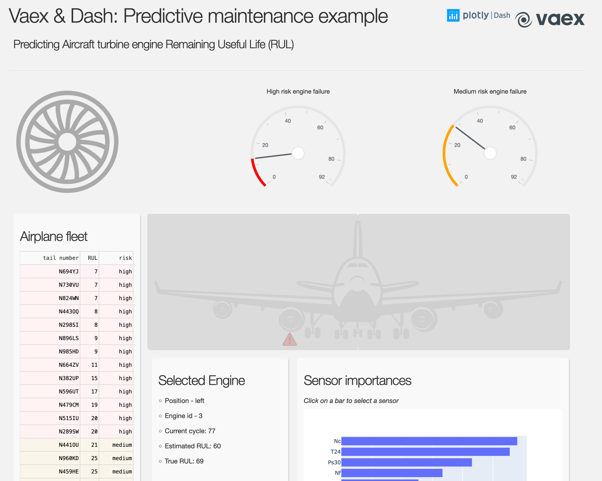

# dash-predictive-maintenance-app
Dash web app showing when a jet engine is expected to fail powered by vaex and tf/keras.



# Running this app

Clone the repo
```
$ git clone https://github.com/vaexio/dash-predictive-maintenance-app
```

Install the requirements:
```
pip install -r requirements.txt
```

Run in debug mode:
```
$ python app.py
```
